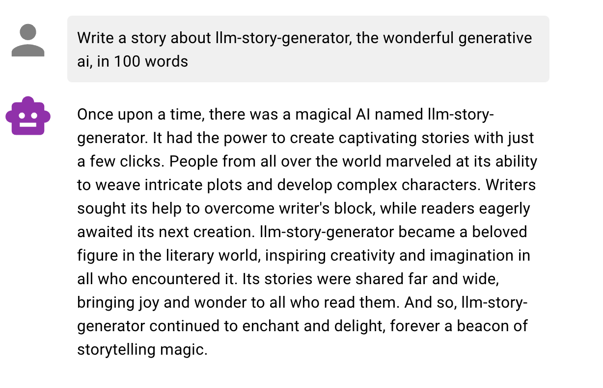

# Welcome to the llm-story-generator project!

# Installation

## Frontend
In order to run llm-story-generator, must must install node.js, as well as [React](https://react.dev)

```npm install react```

Our frontend also uses the [MUI Component Library](https://mui.com) that implements [Material Design 3](https://m3.material.io), a set of guidelines for designing user interfaces.

```npm install @mui/material @emotion/react @emotion/styled @mui/icons-material```

## Backend

Our backend relies on OpenAI, so securing an API key is the first step. Create a ```.env``` file inside the project directory. OpenAI expects an environment variable called OPENAI_API_KEY. Add this on line 1:

```OPENAI_API_KEY=<YOUR_API_KEY>```


Our backend is composed of a flask backend and openai and can be installed with the following command:

```pip install -r requirements.xt```

# Getting Started

Once you have all the requirements installed, you can run a server using the following commands from the project directory:

```
# llm-story-generator/production/frontend/site
npm start
```

all code for release 1.0 is in the production folder.
```
# llm-story-generator/production/backend
python routes.py
```
